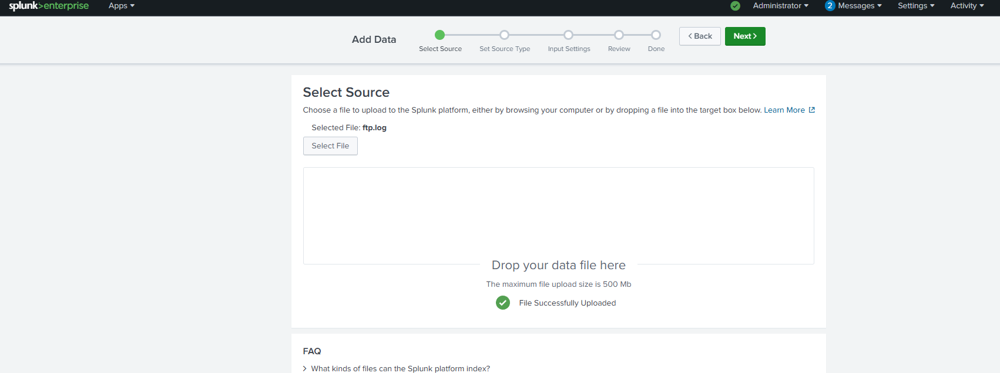
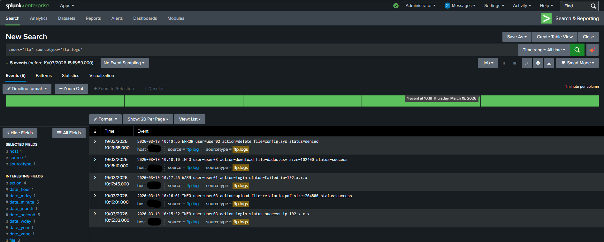
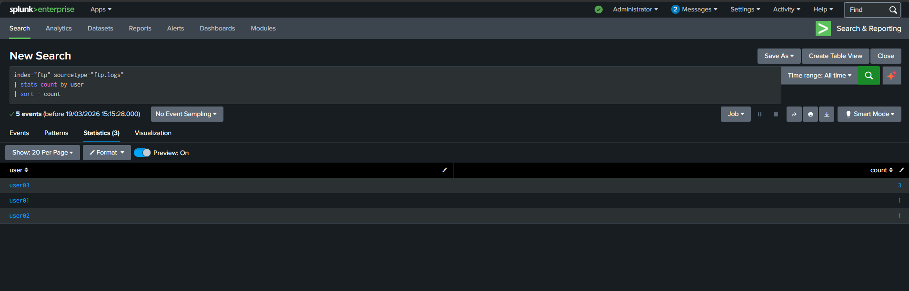
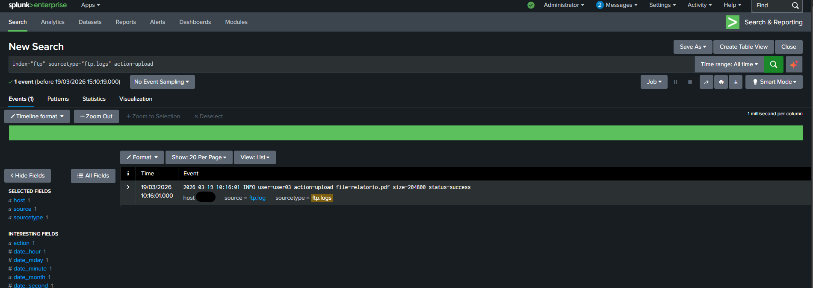
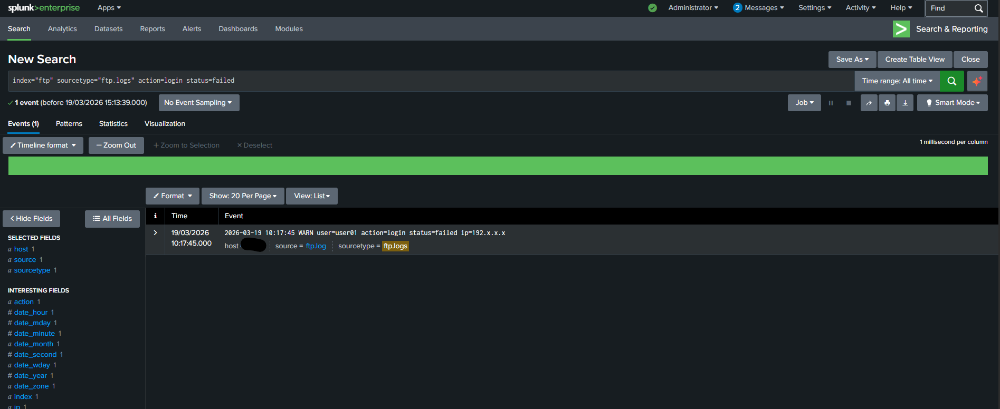
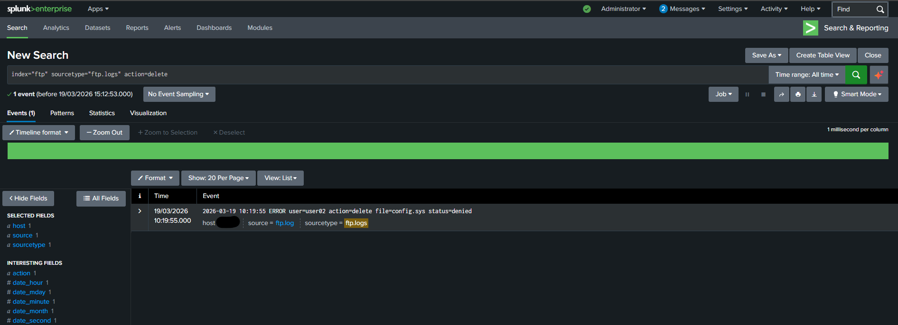
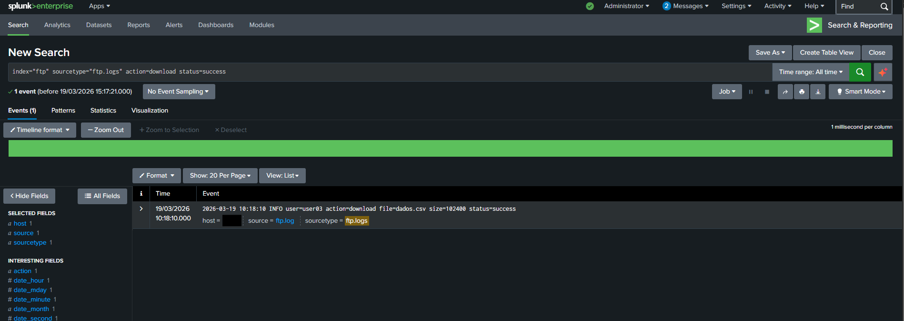

#OBJECTIVE#

Perform the ingestion and analysis of FTP logs using Splunk to identify access patterns and possible anomalies.

#Logs#

The file was manually uploaded to Splunk and analyzed via SPL searches. The created file was fictitious, containing users who do not exist and simulating actions such as login and file manipulation.

File information:

2026-03-19 10:15:32 INFO user=user03 action=login status=success ip=192.x.x.x
2026-03-19 10:16:01 INFO user=user03 action=upload file=relatorio.pdf size=204800 status=success
2026-03-19 10:17:45 WARN user=user01 action=login status=failed ip=192.x.x.x
2026-03-19 10:18:10 INFO user=user03 action=download file=dados.csv size=102400 status=success
2026-03-19 10:19:55 ERROR user=user02 action=delete file=config.sys status=denied

#Analysis#

to view the logs, was used:
index=ftp and
sourcetype=ftp.logs

#Evidences#

File upload

All events

Event count by user

Events envolving: action "file uploads

Events envolving: action "login failed

Events envolving: action "delete"

Events envolving: action "download"

#Conclusion#

The user03 had more events, envolving login success and actions as file download and upload. If these files contained maliciosity, the system/server was compromised. Necessary actions here.
The user02 had just one event, where he tried to delete a file but didn't had success, was denied. Necessary investigate what this file is about.
The user01 also have one event, where he tried to login but failed. No actions needed here.
