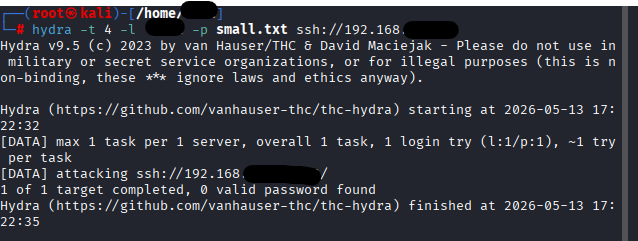
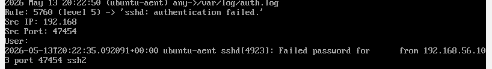
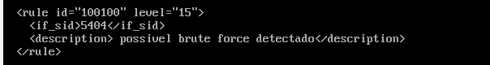
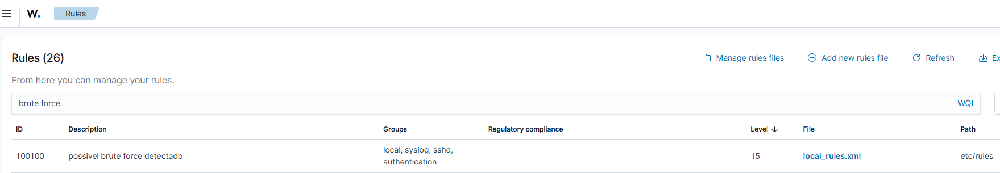
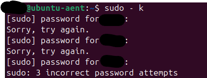
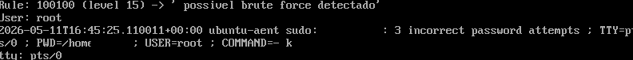
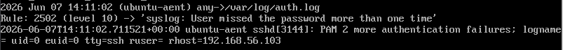
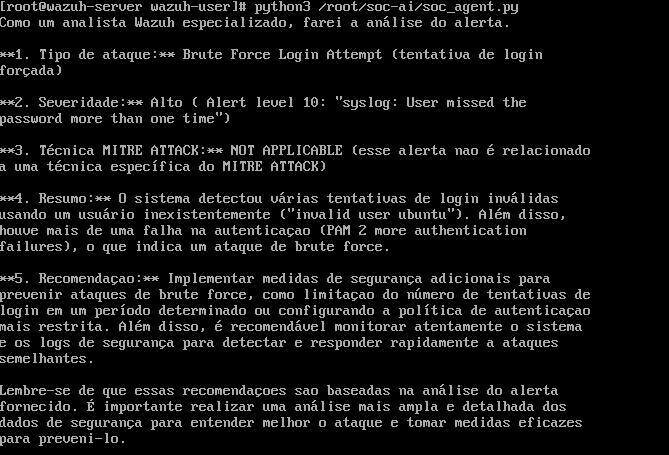
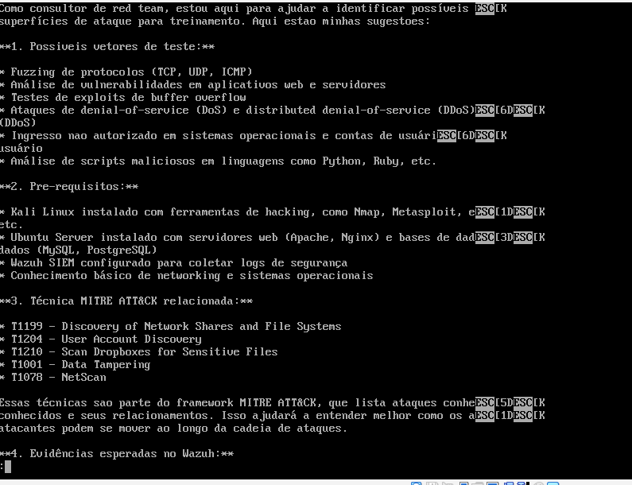
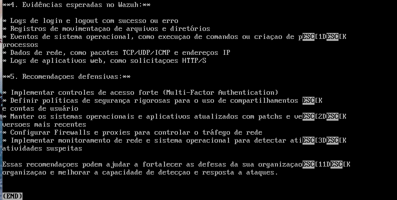

                                                                    
  #                                                                         Objetivo
                                                                              

                                       Integrar i.a com o wazuh siem, estudando a customização de regras e detecção de eventos
                                                          
#

  #                                                                       Tecnologias usadas

                                                                        

                                                                            - Oracle virtualbox
                                                                            - Kali linux VM
                                                                            - Ubuntu VM
                                                                            - Wazuh manager VM
                                                                            - ollama
                                                                            

#                                                                         Conceitos estudados

                                                                          1. LLM security
                                                                          2. MITRE ATTACK
                                                                          3. Técnicas de invasão
                                                                          4. Detecção e análise de logs
                                                                          5. Customização de regras SIEM

                                                                             

# LAB

#1.0 TESTANDO RECEBIMENTO DE LOG PELO WAZUH MANAGER

Primeiramente, testamos se os eventos gerados no ubuntu, estavam sendo coletados pelo wazuh manager
Na vm kali, utilizamos o hydra para tentar encontrar a senha do ubuntu e acessar a vm

Resultado: sucesso!
o wazuh manager detectou a tentativa de autenticação, e esse log foi visualizado a partir do comando: 

#sudo tail -f /var/ossec/logs/alerts/alerts.log

- img do log da falha de autenticação 

#2.0 CUSTOMIZANDO REGRA NO WAZUH

Após acessar as regras pelo comando: 

#nano /var/ossec/etc/rules/local_rules.xml

Utilizamos um id de regra existente para criar uma regra que se adeque ao nosso projeto, focando em detectar tentativas de brute force 

- img da regra criada 
 

Também acessamos a interface gráfica para verificar se a regra constava la:

#2.1 TESTE DE REGRA

Na vm ubuntu, erramos a senha 3 vezes para gerar o alerta de brute force baseado na regra que criamos

A regra funcionou, conforme o alerta abaixo que foi exibido na vm wazuh manager, usando o comando: 

#sudo tail -f /var/ossec/logs/alerts/alerts.log

#3.0 ACESSO SSH E RECONHECIMENTO POR UM IA-AGENT

Pela vm kali, tentamos acessar a maquina ubuntu via ssh, onde erramos a senha 3 vezes propositalmente para gerar novamente o log de brute force

![ssh to ubuntu

- Resultado: o wazuh detectou o acesso ssh, porem, trouxe outra regra relacionada a falha de autenticação. Não é um problema, pois, nossa regra criada foi apenas para detectar
erros de senha na propria maquina ubuntu, o importante é o recebimento de logs funcionando.

#3.1.0 CRIAÇÃO DO AGENTE DE IA

Pelo ollama, fornecemos um prompt para ele atuar como um agente de soc que detecta o ultimo log recente e explica sobre ele, fornecendo também recomendação de como lidar com o problema.

Comando para criar o prompt:

#nano soc_agent.py

Prompt:

import subprocess
with open("/var/ossec/logs/alerts/alerts.log", "r") as arquivo:
    linhas = arquivo.readlines()
alerta = "".join(linhas[-30:])
prompt = f"""
Você é um analista SOC especializado em Wazuh.
Analise o alerta abaixo.
ALERTA:
{alerta}
Retorne:
1. Tipo de ataque
2. Severidade
3. Técnica MITRE ATT&CK
4. Resumo
5. Recomendação
"""
resultado = subprocess.run(
    ["ollama", "run", "llama3", prompt],
    capture_output=True,
    text=True
)
print(resultado.stdout)

#3.1.1 TESTANDO O AGENTE

Rodamos o agente com o comando:

#python3 soc_agent.py

Resultado: o agente funcionou, ele trouxe o ultimo log gerado pela tentativas de falha da senha.

- img do alerta do agente

  

  

#4.0 CRIAÇÃO DE ASSISTENTE DE IA RED TEAM

No ollama, tambem criamos via prompt, um assistente red team com o proposto de encontrar possiveis vetores de ataque no ambiente baseado nas informações que passamos para ele. A partir disso, ele também forneceria 
técnicas mitre, evidencias esperadas apos os testes e contramedidas. O objetivo que passamos foi para avaliar a exposição em cima de acesso ssh no ambiente, mas podia ter sido sugerido outro tipo de serviço. 
Lembrando que o objetivo desse assistente, é informar que tipos de teste podemos fazer em um ambiente como esse, ele não analisa o estado atual do ambiente.

Comando para criar o prompt:

#nano redteam_agent.py

Prompt:

import subprocess
prompt = """
Você é um consultor de Red Team em um laboratório autorizado.
Ambiente:
- Kali Linux
- Ubuntu Server
- Wazuh SIEM
Objetivo:
Identificar possíveis superfícies de ataque para treinamento.
Retorne:
1. Possíveis vetores de teste
2. Pré-requisitos
3. Técnica MITRE ATT&CK relacionada
4. Evidências esperadas no Wazuh
5. Recomendações defensivas
"""
resultado = subprocess.run(
    ["ollama", "run", "llama3", prompt],
    capture_output=True,
    text=True
)
print(resultado.stdout)

#4.0.1 ANALISANDO O RESULTADO

Apos rodar o assistente, pelo comando:

#python redteam_agent.py

o resultado foi conforme esperado, o assistente fez uma analise baseada nos ambientes que informamos para ele, e trouxe possiveis superficies de ataque relacionados a acesso ssh.

- imagem do aleta dividido 

